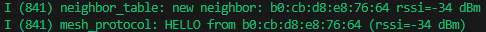
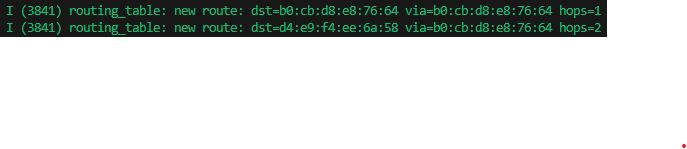
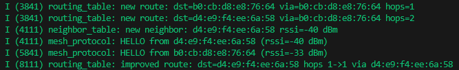
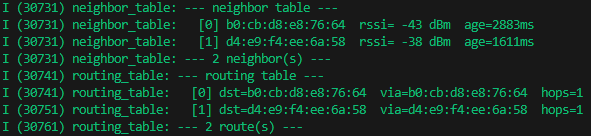
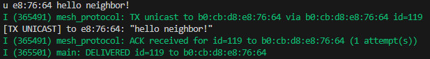

# Miles Rovenger Mesh Network (ESP-32)

A simple custom mesh networking stack built from scratch in C on ESP32 using ESP-IDF. No high-level mesh libraries every routing decision, packet format, and protocol mechanism is hand-written.

---

## Demo


---

## Hardware

- 3× ESP32 DevKit V1
- 3× SSD1306 128×64 OLED display (I2C)
- 3x USB cables for flashing

**OLED wiring per board:**
```
ESP32 3V3  →  OLED VCC
ESP32 GND  →  OLED GND
ESP32 G21  →  OLED SDA
ESP32 G22  →  OLED SCL
```


---

## Architecture

The project is organized into clean layers, each with a single responsibility:

```
main.c              — application layer (UI, serial console, OLED display)
mesh_protocol.c     — transport layer (ESP-NOW, routing, ACK/retransmission)
routing_table.c     — distance-vector routing table
neighbor_table.c    — neighbor discovery and RSSI tracking
dedup_cache.c       — ring buffer to detect packets this device has already seen
oled.c              — SSD1306 I2C display driver
```

### Packet Format

Every frame has a fixed packed header followed by a variable-length payload:

```c
typedef struct __attribute__((packed)) {
    uint8_t  src_mac[6];     // originating node
    uint8_t  dst_mac[6];     // FF:FF:FF:FF:FF:FF = broadcast
    uint16_t msg_id;         // per-source sequence number (dedup)
    uint8_t  ttl;            // hops remaining before drop
    uint8_t  msg_type;       // DATA, HELLO, ACK, ROUTE_UPDATE, UNICAST
    uint8_t  payload_len;    // bytes used in payload[]
    uint8_t  payload[200];   // 200 is our max payload size
} mesh_packet_t;
```

`__attribute__((packed))` prevents compiler padding so the byte layout is identical across all nodes. A packet is simply a collection of raw bytes that we can send between devices and are unpacked and turned into usable data by 

---

## Features

### Neighbor Discovery
Each node broadcasts a `HELLO` beacon every 5 seconds. Every node that receives one records the sender's MAC and RSSI in a neighbor table. Entries expire after 15 seconds of silence.



### Distance-Vector Routing
Nodes periodically broadcast their routing tables to neighbors via HELLO beacons. When we recieve a HELLO, the node applies the Bellman-Ford update rule to find its distance and route from the node, if a neighbor can reach destination X in N hops, this node can reach X in N+1 hops via that neighbor. Split horizon prevents count-to-infinity loops by never advertising a route back to the neighbor it was learned from.

### Routing Improvements

Imagine a situation where three nodes are all close enough to each other to where each can transmit data to each other via 1 hop. Node 1 connects to node 2 first via 1 hop, node 3 connects to node 1 via 1 hop, but gets its routing data for node 2 via node 1, thereby believing it can only access node 2 via node 1 with 2 hops. Nodes periodically broadcast their routing tables to neighbors via route update packets and can update their routes accordingly.

The route starts at 2 hops:


Route is later improved after route update is broadcasted:



### Flooding with Deduplication
Broadcast packets are flooded — every node rebroadcasts every packet it receives. A fixed-size ring buffer tracks `(src_mac, msg_id)` pairs and drops duplicates. TTL limits the maximum hop count.

### Unicast Routing
`mesh_send_unicast()` looks up the next hop in the routing table and sends directly to that neighbor. The neighbor repeats the lookup and forwards toward the destination. Packets are never broadcast — each takes a single directed path.



### ACK and Retransmission
Every unicast packet is tracked in a pending ACK table. The destination node sends an ACK immediately on receipt. If no ACK arrives within 500ms, the sender retransmits up to 3 times. After 3 failed attempts a delivery failure callback fires.

```
TX unicast to e8:76:64 via e8:76:64 id=12
ACK received for id=12 (1 attempt(s))
DELIVERED id=12 to e8:76:64
```

If the destination is unreachable:
```
retransmitting id=12 (attempt 2/3)
retransmitting id=12 (attempt 3/3)
FAILED id=12 to e8:76:64
```

---

## Serial Console

Each node exposes a command interface over UART. Connect via the ESP-IDF monitor and type:

| Command | Description |
|---------|-------------|
| `b <message>` | Broadcast to all nodes |
| `u <xx:xx:xx> <message>` | Unicast to node by last 3 MAC bytes |
| `nodes` | Print neighbor and routing tables |

Example:

b hello everyone

u e8:76:64 hey you specifically

---

## Key Design Decisions

**Packed structs for on-wire format** — `__attribute__((packed))` ensures no compiler padding corrupts the byte layout between nodes compiled with different settings.

**Dedup before routing** — duplicate packets are dropped before any routing decision is made, preventing the routing table from being updated with stale data from re-broadcasts.

**Split horizon** — nodes never advertise a route back to the neighbor they learned it from, preventing the count-to-infinity problem in distance-vector routing.

**Async ACKs** — `mesh_send_unicast` returns immediately. Up to 16 packets can be in-flight simultaneously, each tracked and retransmitted independently by a background task. This avoids the throughput bottleneck of stop-and-wait.
